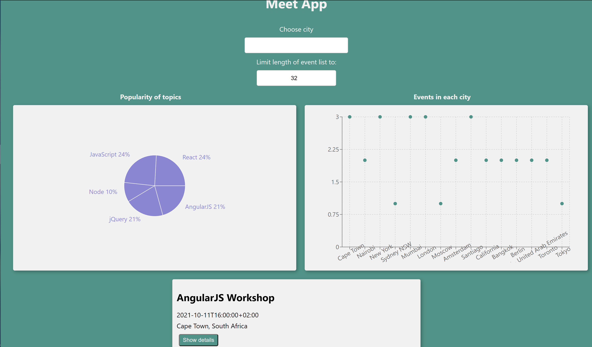

# Meet App

A serverless, progressive web application (PWA) allowing users to  
* view a list of events
* search for a city and get a list of events hosted in that city
* view two charts - one that shows how many events will take place in that city on upcoming days, and another
that visualizes the popularity of event genres in the form of a pie chart.



## Key Features
* Filter events by city
* Show/hide event details
* Specify number of events to display
* Fully responsive
* Use the app also when offline (PWA)
* Add an app shortcut to the home screen (PWA)
* View a chart showing the number of upcoming events by city
* View a chart of the popularity of event topics
* Alert system (city not found ; invalid number of events to show)

## Feature details, user stories and scenarios

#### FEATURE 1: FILTER EVENTS BY CITY
*User Story:*
As a user I should be able to filter events by city so that I can see the list of events that take place in that city
* Scenario 1: When user hasn’t searched for a city, show upcoming events from all cities.
_Given_ the user hasn’t searched for any city
_When_ the user opens the app
_Then_ the user should see a list of all upcoming events
* Scenario 2: User should see a list of suggestions when they search for a city.
_Given_ the main page is open
_When_ the user starts typing in the city textbox
_Then_ the user should see a list of cities (suggestions) that match what they’ve typed
* Scenario 3: User can select a city from the suggested list.
_Given_ the user was typing “Berlin” in the city textbox And the list of suggested cities is showing
_When_ the user selects a city (e.g., “Berlin, Germany”) from the list
_Then_ their city should be changed to that city (i.e., “Berlin, Germany”) And the user should receive a list of upcoming events in that city

#### FEATURE 2: SHOW/HIDE AN EVENT’S DETAILS
*User Story:*
As a user I should be able to show/hide the details of an event so that I can see more/less information about an event
* Scenario 1: An event element is collapsed by default.
_Given_ the user has not clicked on a specific event
_When_ the user is viewing the list of events
_Then_ the details of each event are collapsed/hidden
* Scenario 2: User can expand an event to see its details.
_Given_ the user is viewing the list of events
_When_ the user clicks on one event
_Then_ the user should see a expanded view with details of the event
* Scenario 3: User can collapse an event to hide its details.
_Given_ the user is viewing (expanded) details of one events
_When_ the user returns to the list of events
_Then_ the user details of the event should collapse to show the full list of events again

#### FEATURE 3: SPECIFY NUMBER OF EVENTS
*User Story:*
As a user I should be able to adjust the number of events displayed so that I can see the an appropirately long list of events
* Scenario 1: When user hasn’t specified a number, 32 is the default number.
_Given_ the user has not specified the number of events to be displayed
_When_ the user is viewing the list of events
_Then_ the default number of 32 events are displayed
* Scenario 2: User can change the number of events they want to see.
_Given_ the list of events is displayed (or should this be in a separate "settings" section?)
_When_ the user specifies the number of events
_Then_ the length of the events list displayed per page is adjusted according to the specified number

#### FEATURE 4: USE THE APP WHEN OFFLINE
*User Story:*
As a user I should be able to use the app while I am offline so that I can still use when there is no internet connection to see the events view the last time I was online
* Scenario 1: Show cached data when there’s no internet connection.
_Given_ the user currently has no connection to the internet
_When_ the user wants to use the app
_Then_ cached data is used to show the events
* Scenario 2: Show error when user changes the settings (city, time range).
_Given_ the user is currently offline
_When_ the user wants changes the settings (city, time range)
_Then_ an error message is displayed

#### FEATURE 5: DATA VISUALIZATION
*User Story:*
As a user I should be able to see a chart with the number of upcoming events in each city so that I can see how many events are happening in each city
* Scenario 1: Show a chart with the number of upcoming events in each city.
_Given_ the main page is open
_When_ the user clicks on "show events per city" (or is the chart always part of the main page?)
_Then_ a chart with the number of upcoming events in each city is displayed

## Built With
Created using React following a test-driven development (TDD) approach (coverage rate >= 90%).
App is PWA according to [Lighthouse’s PWA checklist](https://developers.google.com/web/tools/lighthouse/)

- Major languages: Javascript
- Frameworks: React (CRA)
- Technologies used:
    * gh-pages package for easy deployment
    * serverless package with aws-nodejs template
    * Serverless functions hosted on AWS lambda (Faas) (used for auth-server)
    * [Google Calendar API](https://developers.google.com/calendar) (and OAuth2 authentication) to fetch upcoming events 
    * (React Bootstrap for styling)
    * axios (async/await) for AJAX
    * nprogress package to display a progress bar while events are fetched
    * recharts to display a chart
    * Jest and Enzyme (shallow rendering for unit-testing & full rendering for integration-testing) (testfiles in "tests" folder)
    * Jest-Cucumber (BDD acceptance testing) (tesfiles in "features" folder)
    * Puppeteer (end-to-end tests) (testfiles in "tests" folder)

The application itself is also hosted on gh-pages to make it shareable and installable. 

## Live Demo

[Live Demo Link](https://MitoMonkey.github.io/meet)

### Run tests
* `http-server` (in "static-site-test" folder) - starts a local test server for the OAuth2 process ("auth-server" folder).
* `npm test` - Starts the Jest test runner, leaving it in watch mode.
* `npm run coverage` - Starts a Jest unit test run to evaluate test coverage.

### Deployment
* `serverless deploy` to update the functions on AWS lambda
* `npm start` - Starts the development server.
* `npm run build` - CRA commant to bundle the app into static files for production.
* `npm run deploy`- CRA commant to build the project and uploads it to Github pages.
* `npm run eject` - Removes CRA and copies build dependencies, configuration files and scripts into the app directory. If you do this, you can’t go back!

The "config.json" file for the auth-server needs to be added manually, as this data contains privat API data.
Format:
```
{
    "CLIENT_ID": "YOUR-CLIENT-ID",
    "PROJECT_ID": "YOUR-PROJECT-ID",
    "CLIENT_SECRET": "YOUR-CLIENT-SECRET",
    "CALENDAR_ID": "YOUR-CALENDAR-ID"
}
```

## Author:
👤 **Mito.this**
- GitHub: [@MitoMonkey](https://github.com/MitoMonkey/)
- LinkedIn: [LinkedIn](https://www.linkedin.com/in/michael-flohrsch%C3%BCtz-8a58321b3/)

Created during the Fullstack Webdevelopment course @CareerFoundry

Contributions, issues, and feature requests are welcome!

Feel free to check the [issues page](../../issues/).